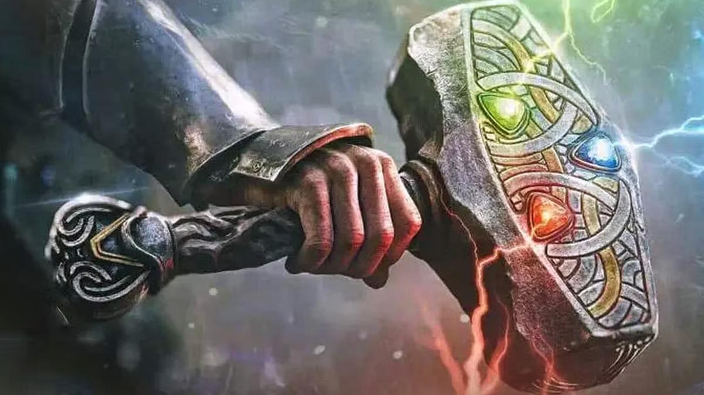

# Religion

## Deities & Demigods

Greater powers, Greater Deities, Intermediate Deities, Lesser Deities, Demigods, Exarchs

## Clerics, Warlocks, Champions

How people get their power basically

## Instruments & Artifacts

A bit about how the power of the gods can be channeled through temples, shrines, Holy and Profane Symbols, artifacts, incantations, prayers, congregations

### Favored Weapons

::: {.center-img}
{width=90%}
:::
\
A favored weapon is a type of weapon associated with a particular deity. It is of particular importance to that deity and it's followers. Clerics often wield their deity's favored weapon as a point of pride. Some divine spells differ based on the deity's favored weapon. For example, a cleric of Poseidon who casts the spell spiritual weapon will manifest it in the form of a trident.

Notable examples of favored weapons include the warhammer, wielded by Thor, Moradin and their clerics; the spear, wielded by clerics of Odin and Zeus; and the longsword, wielded by followers of King Arthur and Heimdall.

It is generally accepted that all deities have a favored weapon. For some, that weapon is unarmed strike, although this is not the same as having no favored weapon. Some monstrous deities have a creature's natural weapon as their favored weapon. Examples include the sahuagin deity Sekolah, whose favored weapon is their bite. Some Archfey, Archdevils, and Demon Lords powerful enough to have worshipers also have a favored weapon.

Characters of all classes who dedicate themselves to a particular deity can gain the ability to wield the weapon of their god and channel its divine power. Details on Holy, Unholy & Profane weapons can be found on the Signature Items page.

## List of Gods

```{r, echo=FALSE}

library(DT)

Gods_list <- read.csv("_data/Gods_list.csv", fileEncoding = "Windows-1252")

datatable(
  Gods_list,
  filter="top"
)

```

## List of Patrons


