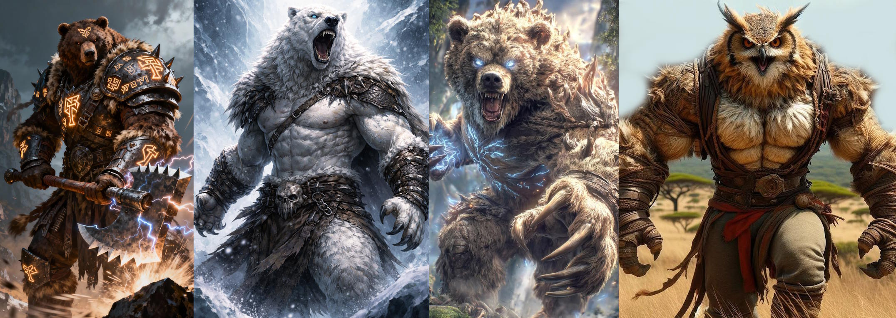
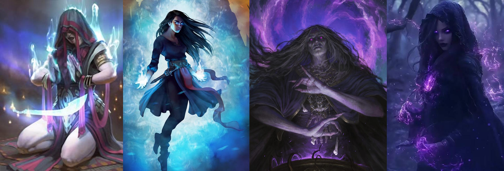
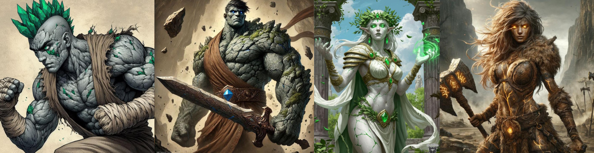
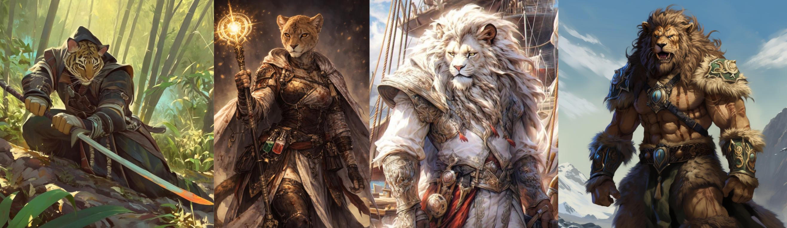
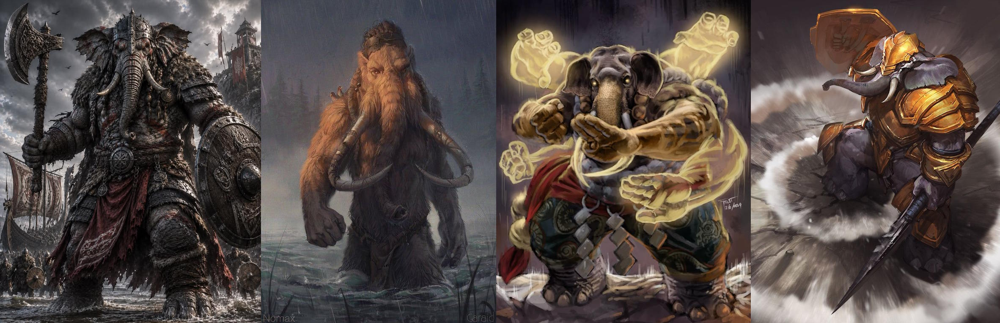
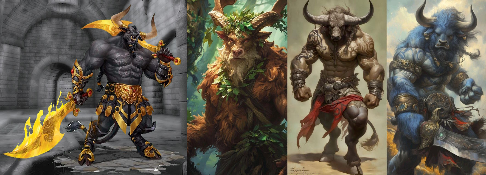
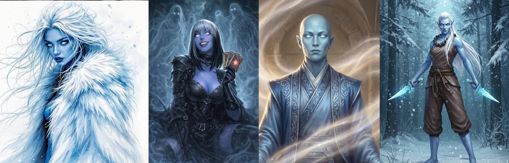

# Races & Species

## Existing D&D Races & Species allowed

Plasmoid

Heliana's Races

Grim Hollow Races

Regular D&D: Human, Halfling, Elf, Aasimar, Tiefling, Gnome, Dwarf, Genasi(4x from Mordenkainen's), Goblin, Hobgoblin, Kenku, Kobold, Tabaxi, Triton, Gith, Tortle, Dhampir, Hexblood, Reborn, Changeling, Duergar, Eladrin, Harengon, Shadar Kai, [Eberron: Forge of the Artificer races]

## Notes on Large Characters {#large-races}

::: sub-heading
Large Character Traits
:::

Unless otherwise specified, large player characters always gain the following traits:

**Ability Scores.** As a Large creature, you are innately much stronger but slower than your medium comrades. When creating your character, in addition to other ability score modifiers you increase your base strength score by 2, and decrease your base dexterity score by 2. As a large character, your default maximum strength score is 22, and your maximum Dexterity score is 18.

**Carrying Capacity.** Your carrying Capacity is your Strength score multiplied by 30. This is the weight (in pounds) that you can carry. You can push, drag, or lift a weight in pounds up to twice your carrying Capacity (or 60 times your Strength score). While pushing or dragging weight in excess of your carrying Capacity, your speed drops to 5 feet.

**Armor.** Due to your large size, normal armor built for a humanoid will not fit you. You can get specially made armour to fit your large build, although it weighs double and costs 4 times as much as the listed value. Enchanted armor which is considered rare or higher will magically scale to fit your size, as will any rings or bands etc.

**Weapons.** Due to your large size, typical light weapons are virtually unusable to you, regular weapons designed for medium creatures are much lighter for you, and you are capable of wielding weapons larger still. See the weapons table chapter for more info. Enchanted weapons which are rare or higher will magically scale to their large size equivalents (This will be detailed in the weapon stats).

**Food.** Due to your immense height and weight, you require 4x the amount of food of a medium humanoid.

**Grappling** You have Advantage on any ability check you make to end the Grappled condition. You can also grapple creatures up to Huge size (or larger if your size has been increased beyond large)

## Bearfolk

::: center-img
{width="100%"}
:::

\

::: sub-heading
Creature Type
:::

You are considered both a Humanoid and a Fey.

::: sub-heading
Age
:::

Bearfolk mature and age at about the same rate as humans.

::: sub-heading
Size
:::

Bearfolk vary in size depending on their subrace, with heights ranging between 5 and over 8 feet tall, and sizes from medium to large.

::: sub-heading
Speed
:::

Your base walking speed is 30 feet.

::: sub-heading
Claws
:::

Your claws are natural weapons, which you can use to make unarmed strikes. If you hit with them, you can deal slashing damage equal to 1d4 + your Strength modifier, instead of the bludgeoning damage normal for an unarmed strike.

You also gain a climb speed equal to your move speed.

::: sub-heading
Powerful Build
:::

You have Advantage on any ability check you make to end the Grappled condition. You also count as one size larger when determining your carrying capacity.

::: sub-heading
Thick Hide
:::

You are covered in a layer of thick, insulating fur, sheltering you from the harsh conditions of the outdoors. You have a base armor class of 12 + your dexterity bonus when unarmored, and are immune to the environmental effects of extreme cold.

::: sub-heading
Wild at Heart
:::

You are naturally adept at surviving in the wilds, granting you proficiency in the survival and perception skills.

::: sub-heading
Ursine Origin (variant races)
:::

Though originating in the feywild, the Bearfolk still share a connection with their wild counterparts. You may choose from the following alternative ursine ancestries. Features here replace the ones listed above where noted.

**Cave Bear**: The most common Bearfolk race.

**Polar Bear**: Your size is Large (*replaces powerful build*). Your claw attack deals 1d8 plus Strength slashing damage. You gain a swimming speed equal to your walking speed (*replaces climb speed*). You gain resistance to cold damage.

**Owlbear**: Your size is Large (*replaces powerful build*). Your claw attack deals 1d8 plus Strength slashing damage. You gain darkvision up to 60ft, allowing you to see in dim light within 60 feet of you as if it were bright light and in darkness as if it were dim light. You can’t discern color in darkness, only shades of gray. Due to the tough spines of their feathered hides and pseudo-winged arms, Owlbear Bearfolk cannot wear heavy armor.

## Bugbear

(As Mordenkainen's but with new powerful Build, option for large, and clarification on reach not affecting polearms)

## Centaur

::: center-img
{width="100%"}
:::

::: center-img
[\> Click if you don't get the reference \<](https://www.youtube.com/watch?v=6v_R180kIGs)
:::

::: sub-heading
Creature Type
:::

You are considered both a Humanoid and a Fey

::: sub-heading
Age
:::

Centaurs mature and age at about the same rate as humans.

::: sub-heading
Size
:::

Centaurs are usually between 8 to 10 feet tall with their equine bodies reaching over 5 feet at the withers, and weigh anything from 800 to 1500 pounds. Your size is **Large**.

::: sub-heading
Speed
:::

Your base walking speed is 40 feet.

::: sub-heading
Charge
:::

If you move at least 30 feet straight toward a target and then hit it with a melee weapon attack on the same turn, you can immediately follow that attack with a bonus action, making one attack against the target with your hooves.

::: sub-heading
Hooves
:::

You have hooves that you can use to make unarmed strikes. When you hit with them, the strike deals 1d8 + your Strength modifier bludgeoning damage, instead of the bludgeoning damage normal for an unarmed strike.

::: sub-heading
Equine Build
:::

You count as one size larger when determining your carrying capacity and the weight you can push or drag. You cannot ride other creatures as mounts, but can serve as a mount for a medium or smaller creature.

In addition, any climb that requires hands and feet is especially difficult for you because of your equine legs. When you make such a climb, each foot of movement costs you 4 extra feet, instead of the normal 1 extra foot.

::: sub-heading
Survivor
:::

You have proficiency in one of the following skills of your choice: Animal Handling, Medicine, Nature, or Survival.

## Dragonborn (big)

(A mix of 5e 2024 and Fizban's Treasury of Dragons, with a powerful build variant)

## Dreamspeaker

::: center-img
{width="100%"}
:::

\

::: sub-heading
Creature Type
:::

Your creature type is Humanoid.

::: sub-heading
Age
:::

Dreamspeakers are largely biologically identical to another humanoid race (human, elf, dwarf, or halfling) and mature and age at the same rate.

::: sub-heading
Size
:::

Your size is Small or Medium.

::: sub-heading
Speed
:::

Your base walking speed is 30 feet.

::: sub-heading
Dual Mind
:::

You have advantage on all Wisdom saving throws.

::: sub-heading
Mental Discipline
:::

You have resistance to psychic damage.

::: sub-heading
Mind Link
:::

You can speak telepathically to any creature you can see, provided the creature is within a number of feet of you equal to 10 times your level. You don’t need to share a language with the creature for it to understand your telepathic utterances, but the creature must be able to understand at least one language.

When you’re using this trait to speak telepathically to a creature, you can use your action to give that creature the ability to speak telepathically with you for 1 hour or until you end this effect as an action. To use this ability, the creature must be able to see you and must be within this trait’s range. You can give this ability to only one creature at a time; giving it to a creature takes it away from another creature who has it.

::: sub-heading
Dream Walker
:::

Dreamspeakers possess a near perfect control of their conscious and subconscious mind, allowing them to retain full lucidity when unconscious, and even to enter the minds of other willing creatures. When sleeping, dreamspeakers may always choose to lucid dream, and may enter other willing creature's dreams so long as that creature is within the range of their telepathy. Dreamspeakers are also immune to spells that would put them to sleep against their will.

If a dreamspeaker is a spellcaster, they automatically have the following spells prepared in addition to those granted by their class: Detect Thoughts, Modify Memory, Dream.

## Earth Genasi

::: center-img
{width="100%"}
:::

\

::: sub-heading
Creature Type
:::

You are considered both a Humanoid and Elemental.

::: sub-heading
Age
:::

Earth Genasi mature and age at about the same rate as humans.

::: sub-heading
Size
:::

Earth Genasi are typically over 6 feet tall, with some standing over 7 feet. Your size is Medium. Earth Genasi are considerably denser than most humanoids, with weights typically ranging from 200 to 300 pounds.

::: sub-heading
Speed
:::

Your base walking speed is 30 feet.

::: sub-heading
Earth Walk
:::

You can move across difficult terrain without expending extra movement if you are using your walking speed on the ground or a floor.

::: sub-heading
Merge With Stone
:::

You know the blade ward cantrip.

Starting at 3rd level, you can cast the earth tremor spell with this trait, without requiring a spell slot. Once you cast the spell with this trait, you can’t do so again until you finish a long rest. You can also cast it using any spell slots you have of 1st level or higher.

Starting at 5th level, you can cast the meld into stone spell with this trait, without requiring a spell slot. Once you cast that spell with this trait, you can’t do so again until you finish a long rest, except as a ritual. You can also cast it using any spell slots you have of 3rd level or higher.

Intelligence, Wisdom, or Charisma is your spellcasting ability for these spells when you cast them with this trait (choose when you select this race).

::: sub-heading
Tremorsense
:::

You gain Tremorsense with a range of 60 feet. You must be touching a stone or earthen surface to use this Tremorsense. The stone or earth can be natural or worked.

::: sub-heading
Powerful Build
:::

You have Advantage on any ability check you make to end the Grappled condition. You also count as one size larger when determining your carrying capacity.

## Firbolg

::: center-img
{width="100%"}
:::

\

::: sub-heading
Creature Type
:::

You are considered both a Humanoid and a Giant

::: sub-heading
Age
:::

As giant humanoids originating in the feywild, firbolg have long lifespans. A firbolg reaches adulthood around 30, and the oldest of them can live for 500 years.

::: sub-heading
Size
:::

Firbolgs are around 10 feet tall and weigh between 500 and 750 pounds. Your size is **Large**.

::: sub-heading
Speed
:::

Your base walking speed is 30 feet.

::: sub-heading
Firbolg Magic
:::

You can cast detect magic and disguise self with this trait, using Wisdom as your spellcasting ability for them. Once you cast either spell, you can’t cast it again with this trait until you finish a short or long rest. When you use this version of disguise self, you can seem up to 4 feet shorter than normal, falling under the effects of the "reduce" option of enlarge/reduce for the duration, allowing you to more easily blend in with humans and elves.

::: sub-heading
Rock thrower
:::

You are proficient in using small objects and creatures as thrown projectile weapons. You may treat any sufficiently robust Small object or creature you are holding as an improvised thrown weapon you are proficient in, with a range of 20/60, and dealing 1d8 + Strength damage to the target (and object if appropriate).

If you have a hand free you may attempt to catch such an object being hurled or fired at you. When you are hit by a ranged attack whose projectile is a small object or creature, as a reaction you may reduce the damage dealt by that projectile by 1d12 plus your Strength modifier. If this damage is reduced to zero, you catch the object and may throw it back as part of the reaction. you can do this a number of times equal to your proficiency bonus, and you regain all expended uses when you finish a long rest.

## Goliath

::: center-img
{width="100%"}
:::

\

::: sub-heading
Creature Type
:::

You are considered both a Humanoid and a Giant

::: sub-heading
Age
:::

Goliaths have lifespans comparable to humans. They enter adulthood in their late teens and usually live less than a century.

::: sub-heading
Size
:::

Goliath range from 7 to 10 feet tall and weigh between 300 and 650 pounds. Your size can be **Medium** or **Large**.

::: sub-heading
Speed
:::

Your base walking speed is 35 feet.

::: sub-heading
Giant Ancestry
:::

You are descended from Giants. Choose one of the following benefits—a supernatural boon from your ancestry; you can use the chosen benefit a number of times equal to your Proficiency Bonus, and you regain all expended uses when you finish a Long Rest:

**Cloud’s Jaunt (Cloud Giant).** As a Bonus Action, you magically teleport up to 30 feet to an unoccupied space you can see.

**Fire’s Burn (Fire Giant).** When you hit a target with an attack roll and deal damage to it, you can also deal 1d10 Fire damage to that target.

**Frost’s Chill (Frost Giant).** When you hit a target with an attack roll and deal damage to it, you can also deal 1d6 Cold damage to that target and reduce its Speed by 10 feet until the start of your next turn.

**Hill’s Tumble (Hill Giant).** When you hit a Large or smaller creature with an attack roll and deal damage to it, you can give that target the Prone condition.

**Stone’s Endurance (Stone Giant).** When you take damage, you can take a Reaction to roll 1d12. Add your Constitution modifier to the number rolled and reduce the damage by that total.

**Storm’s Thunder (Storm Giant).** When you take damage from a creature within 60 feet of you, you can take a Reaction to deal 1d8 Thunder damage to that creature.

::: sub-heading
Goliath Size
:::

Goliaths sit on the border between medium and large races, which they fall into is entirely dependant on the individual. Depending on the size you choose when creating this character, you gain the following traits:

**Lithe Half-Giant.** If you are a **Medium** Goliath, you have Advantage on any ability check you make to end the Grappled condition. You also count as one size larger when determining your carrying capacity. You use the rules for large creatures when it comes to the weapons you can wield. Your maximum height is 8ft tall and you require double the food of a medium humanoid.

**Towering Half-Giant.** If you are a **Large** Goliath, you gain all the [traits granted to Large characters](#large-races) including ability score modifiers, armor and weapon tables. Your maximum height is 10ft tall.

## Half Ogre

::: center-img
{width="100%"}
:::

\

::: sub-heading
Creature Type
:::

You are considered both a Humanoid and a Giant

::: sub-heading
Age
:::

Half-Ogres reach adulthood at age 12 and live up to 50 years.

::: sub-heading
Size
:::

Half-Ogres are usually just over 8 feet tall and weigh between 400 and 600 pounds. Your size is **Large**.

::: sub-heading
Speed
:::

Your base walking speed is 30 feet.

::: sub-heading
Darkvision
:::

You can see in dim light within 60 feet of you as if it were bright light, and in darkness as if it were dim light. You can’t discern color in darkness, only shades of gray.

::: sub-heading
Wild Instincts
:::

Due to your imposing stature and requirement to fend for yourself, you are naturally proficient in the Intimidation skill and the survival skill.

::: sub-heading
Gluttonous Hunger
:::

You can eat almost anything and gain advantage on constitution checks and saves against any harmful effects of ingested substances. You can spend 1 minute eating a large meal, or part of a small or larger creature. When you do this you may spend hit die to heal as if you had taken a short rest. You can spend up to your proficiency bonus in hit die this way, either in one sitting or across multiple meals. The number of hit die you can spend in this way resets after a long rest.

## Leonin

::: center-img
{width="100%"}
:::

\

::: sub-heading
Creature Type
:::

You are considered both a Humanoid and a Fey.

::: sub-heading
Age
:::

Leonin mature and age at about the same rate as humans.

::: sub-heading
Size
:::

Leonin are typically over 6 feet tall, with some standing over 7 feet. Your size is Medium.

::: sub-heading
Speed
:::

Your base walking speed is 35 feet.

::: sub-heading
Darkvision
:::

You can see in dim light within 60 feet of you as if it were bright light and in darkness as if it were dim light. You can’t discern color in darkness, only shades of gray.

::: sub-heading
Claws
:::

Your claws are natural weapons, which you can use to make unarmed strikes. If you hit with them, you can deal slashing damage equal to 1d4 + your Strength modifier, instead of the bludgeoning damage normal for an unarmed strike.

::: sub-heading
Hunter's Instincts
:::

You have proficiency in one of the following skills of your choice: Athletics, Intimidation, Perception, or Survival.

::: sub-heading
Daunting Roar
:::

As a bonus action, you can let out an especially menacing roar. Creatures of your choice within 10 feet of you that can hear you must succeed on a Wisdom saving throw or become frightened of you until the end of your next turn. The DC of the save equals 8 + your proficiency bonus + your Constitution modifier. Once you use this trait, you can’t use it again until you finish a short or long rest.

::: sub-heading
Powerful Build
:::

You have Advantage on any ability check you make to end the Grappled condition. You also count as one size larger when determining your carrying capacity.

## Lizardfolk

::: center-img
{width="100%"}
:::

\

::: sub-heading
Creature Type
:::

You are considered a Humanoid.

::: sub-heading
Age
:::

Lizardfolk mature and age at about the same rate as humans. Unlike most creatures, Lizardfolk do not stop growing once they reach maturity, so long as they are kept well-fed.

::: sub-heading
Size
:::

Lizardfolk come in a range of shapes and sizes, Small, Medium, and Large, growing larger as they age. They range from 4ft tall to over 8ft.

::: sub-heading
Speed
:::

Your base walking speed is 30 feet.

::: sub-heading
Hold Breath
:::

You can hold your breath for up to 15 minutes at a time.

::: sub-heading
Natural Armor
:::

You have tough, scaly skin. When you aren’t wearing armor, your base AC is 13 + your Dexterity modifier. You can use your natural armor to determine your AC if the armor you wear would leave you with a lower AC. A shield’s benefits apply as normal while you use your natural armor.

::: sub-heading
Nature's Intuition
:::

Thanks to your mystical connection to nature, you gain proficiency with one of the following skills of your choice: Animal Handling, Medicine, Nature, Perception, Stealth, or Survival.

::: sub-heading
Life-long Growth
:::

You may choose the size of lizardfolk you are playing as. Note, typically the larger a lizardfolk is, the older they are. Choose from one of the options below:

**Schnappi**: Your size is small. You gain a bite attack which is a natural weapon that deals 1d6 plus Strength bludgeoning damage. You also either gain an additional skill pick from the Nature's Intuition feature, or can gain proficiency in one of the following artisan's tools: Cook's Utensils, Brewer's Supplies, Leatherworker's Tools.

**Crocodilian**: Your size is Medium. You gain a bite attack which is a natural weapon that deals 1d8 plus Strength bludgeoning damage. You also gain the Powerful Build feature, granting you Advantage on any ability check you make to end the Grappled condition. You also count as one size larger when determining your carrying capacity.

**Deinosuchian**: Your size is Large. You gain a bite attack which is a natural weapon that deals 1d10 plus Strength bludgeoning damage.

::: sub-heading
Hungry Jaws
:::

You can throw yourself into a feeding frenzy. As a bonus action, you can make a special attack with your Bite. If the attack hits, it deals its normal damage, and you gain temporary hit points equal to your proficiency bonus. You can use this trait a number of times equal to your proficiency bonus, and you regain all expended uses when you finish a long rest.

## Loxodon

::: center-img
{width="100%"}
:::

\

::: sub-heading
Creature Type
:::

You are considered both a Humanoid and a Fey

::: sub-heading
Age
:::

Loxodons mature at the same rate as humans, however, they are considered mature by their people at 60 years old. Their lifespan can be as long as 450 years.

::: sub-heading
Size
:::

Loxodon are usually between 8 to 10 feet tall, and weigh anything from 800 to 1200 pounds. Your size is **Large**.

::: sub-heading
Speed
:::

Your base walking speed is 30 feet.

::: sub-heading
Loxodon Serenity
:::

You have advantage against being charmed or frightened.

::: sub-heading
Trunk
:::

You can grasp things with your trunk, and you can use it as a snorkel. It has a reach of 5 feet, and it can lift a number of pounds equal to ten times your Strength score. You can use it to do the following simple tasks: lift, drop, hold, push, or pull an object or a creature; open or close a door or a container; grapple someone; or make an unarmed strike. Your DM might allow other simple tasks to be added to that list of options. It can't wield weapons or shields or do anything that requires manual precision, such as using tools or magic items or performing the somatic components of a spell.

::: sub-heading
Keen Smell
:::

Thanks to your sensitive trunk, you have advantage on Wisdom (Perception), Wisdom (Survival), and Intelligence (Investigation) checks that involve smell.

::: sub-heading
Elephant's memory
:::

You have gained significant experience across a long life and possess an exceptional memory. When making an intelligence check, you may recall a piece lore you may have previously read or encountered, adding 1d6 to the roll. You can do this a number of times equal to your proficiency bonus and regain all uses after a long rest.

## Minotaur

::: center-img
{width="100%"}
:::

\

::: sub-heading
Creature Type
:::

You are considered both a Humanoid and a Monstrosity.

::: sub-heading
Age
:::

Minotaurs age at the same rate as Humans and live slightly longer, typically up to 120.

::: sub-heading
Size
:::

Minotaurs are usually over 8 feet tall and weigh between 400 and 600 pounds. Your size is **Large**.

::: sub-heading
Speed
:::

Your base walking speed is 30 feet.

::: sub-heading
Horns
:::

You have horns that you can use to make unarmed strikes. When you hit with them, the strike deals 1d8 + your Strength modifier piercing damage, instead of the bludgeoning damage normal for an unarmed strike.

::: sub-heading
Goring Rush
:::

Immediately after you take the Dash action on your turn and move at least 20 feet, you can make one melee attack with your Horns as a bonus action.

::: sub-heading
Hammering Horns
:::

Immediately after you hit a creature with a melee attack as part of the Attack action on your turn, you can use a bonus action to attempt to push that target with your horns. The target must be within 5 feet of you and no more than one size larger than you. Unless it succeeds on a Strength saving throw against a DC equal to 8 + your proficiency bonus + your Strength modifier, you push it up to 10 feet away from you.

::: sub-heading
Labyrinthine Recall
:::

You always know which direction is north, and you have advantage on any Wisdom (Survival) check you make to navigate or track.

## Orcs

::: center-img
{width="100%"}
:::

\

::: sub-heading
Creature Type
:::

You are considered a Humanoid.

::: sub-heading
Age
:::

Orcs mature and age at about the same rate as humans.

::: sub-heading
Size
:::

The average Orc is around 6-7ft tall. Orogs range from 7-8ft and Ogrillons reach up to 9 and a half feet on average.

::: sub-heading
Speed
:::

Your base walking speed is 30 feet.

::: sub-heading
Darkvision
:::

You have Darkvision with a range of 60 feet.

::: sub-heading
Adrenaline Rush
:::

You can take the Dash action as a Bonus Action. When you do so, you gain a number of Temporary Hit Points equal to your Proficiency Bonus.

You can use this trait a number of times equal to your Proficiency Bonus, and you regain all expended uses when you finish a Short or Long Rest.

::: sub-heading
Relentless Endurance
:::

When you are reduced to 0 Hit Points but not killed outright, you can drop to 1 Hit Point instead. Once you use this trait, you can’t do so again until you finish a Long Rest.

::: sub-heading
Orcish Lineage
:::

You may choose to come from one of the following orc lineages, presented in order of how commonly they are encountered:

**Orc**: The common orc, known as noble warriors, skilled smiths and deadly hunters. Your size is Medium. You gain proficiency with one of the following skills of your choice: Animal Handling, Medicine, Nature, History, Stealth, or Survival. You also gain proficiency in one artisan's tool of your choice.

**Orog**: The Orog, a hardy, bulky caste of orcs native to the underdark. Your size is Medium. You gain the Powerful Build feature, granting you Advantage on any ability check you make to end the Grappled condition. You also count as one size larger when determining your carrying capacity.

**Ogrillon**: The ogrillon, known amongst orc tribes as the Varg ("prince" in common), are a hybrid race of orc and ogre descent, incredibly rare and equally feared on the battlefield. If playing as an Ogrillon, your size is Large and your creature type counts as Giant in addition to Humanoid.

## Samsaran

::: center-img
{width="100%"}
:::

\

::: sub-heading
Creature Type
:::

Your creature type is Humanoid and Celestial.

::: sub-heading
Age
:::

Although samsarans reach physical maturity at about the same rate as humans, all but the newly reincarnated samsaran children are reborn at the beginning of young adulthood. Samsarans retain a youthful appearance for over a century, and reach an age in excess of 120 before undergoing a rapid decline, eventually succumbing to their inevitable death and rebirth at around 150 years old.

::: sub-heading
Size
:::

Your size is Medium.

**Variant**: You may decide your samsaran may take other forms, resembling other races rather than their typical human appearance. For example you could have a samsaran dwarf or a samsaran lizardfolk. Furthermore it is up to you if they maintain the same aesthetic racial features after they reincarnate, or whether they randomly change each time as with the reincarnate spell.

In these cases, your size and shape match that of the race you resemble. Otherwise you retain the same stats and abilities, as well as the pale blue skin, white eyes, and clear blood.

::: sub-heading
Speed
:::

Your base walking speed is 30 feet.

::: sub-heading
Ethereal Sight
:::

Your body and soul are one and the same, thus you exist in both the material and ethereal planes as one. You can see into the ethereal plane within 60 feet of you.

::: sub-heading
Lifebound
:::

Your connection to life and death makes you an expert at resisting the urge to die. You have resistance to necrotic damage, and are immune to effects which cause you to instantly die when reduced to zero hitpoints, such as the death ray of a Beholder or Catoblepas (though you still receive any damage they deal).

When you fail a death saving throw, you may choose to reroll the save. If you do, you must use the second roll. You may do this once per long rest.

::: sub-heading
Samsaran Magic
:::

You know the spare the dying cantrip. When you reach 3rd level, you can cast comprehend languages once with this trait without expending a spell slot or material components, and regain the ability to do so when you finish a long rest. If you possess 5th level spell slots, you are able to expend a spell slot to cast reincarnate regardless of if it is on your classes spell list, or whether you are able to learn spells at that level. Intelligence, Wisdom, or Charisma is your spellcasting ability for the spells you cast with this trait (choose the ability when you select the lineage).

::: sub-heading
Shards of the Past
:::

You retain the skills you possessed in a previous life. You gain proficiency in the following:

- Any one Intelligence, Wisdom, or Charisma skill
- Any one artisan tool, gaming set or musical instrument
- Any weapon of your choice.

::: sub-heading
Optional Rule: Innate Reincarnation
:::

::: lore-box
**Note:** How you implement this rule is up to GM discretion. If using this try to discuss with your GM how they would implement this and what the implications for your character may be when being reborn as a different individual, with potentially wildly varying ideals and alignments despite the shared memories of your previous character. The following should be considered guidelines only.

***Innate Reincarnation.*** When the samsaran's body dies, its soul often perseveres. So long as the body remains relatively intact (avoiding cremation, thorough dismemberment etc.), after 24 hours the corpse appears to fade into the ethereal and the soul reincarnates as a new adolescent samsaran on the same plane of existence, regaining all its hit points. The new samsaran is not the same character - stats should be rerolled & reallocated, alignment and ideals determined, as well as any physical features that may change, although the new character may optionally retain any class levels they acquired previously.

Any sufficiently thorough attempt at destroying the body of the samsaran will force the soul to go to the afterlife and not return. Alternatively, if the samsaran lead an exceptionally pious (Good), heinous (Evil), or harmonious (True Neutral / perfectly balanced) life, they may not reincarnate at all and instead pass on to their respective afterlives.

If a Samsaran's life is cut short by particularly evil or unjust means, the soul may become corrupted with a desire for vengeance, reincarnating as a revenant. In this case, the revenant will only be allowed to return as a samsaran once again if it inhabits the samsaran's original body, this body is not destroyed, and the revenant finishes it's task without succumbing to a great evil in the process.
:::

## Thri-Kreen

(Large - 4 arms with powerful build)

## Tortles

(Optional Large Variant)

Tree people

Jardvegar (Tree Dwarf, Fjord Dwarf)

Phoenix Aasimar / Thunderbird Aasimar

Simic Hybrid (Mutagenic)
