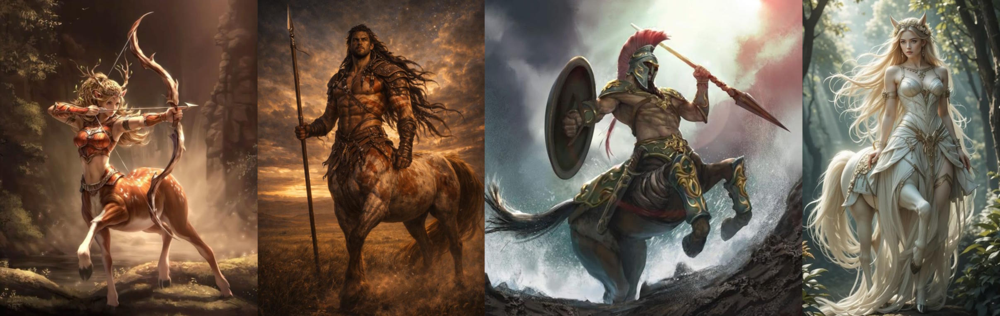
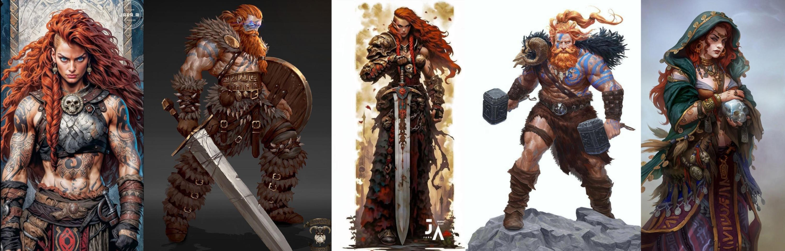
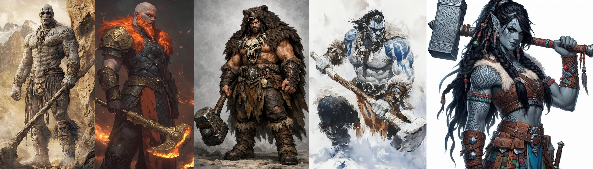
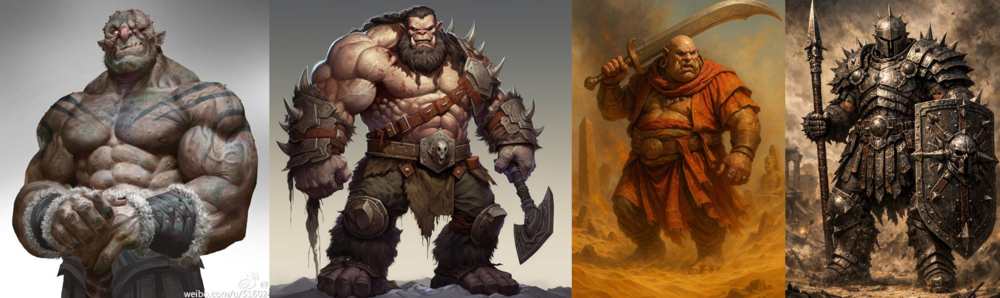
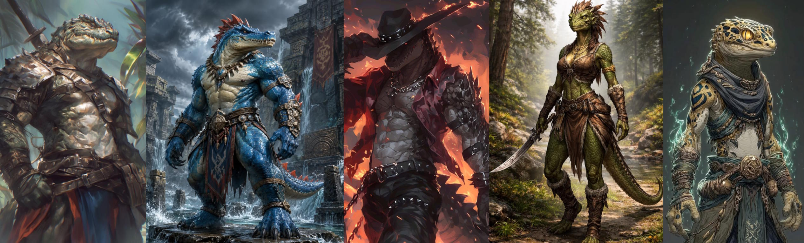
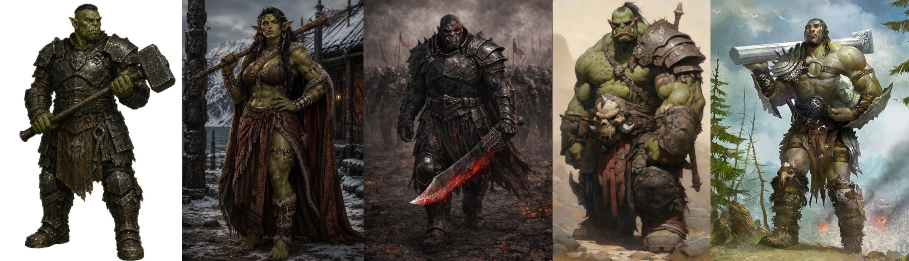

# Races & Species

## Existing D&D Races & Species allowed

Plasmoid

Heliana's Races

Grim Hollow Races

Regular D&D: Human, Halfling, Elf, Aasimar, Tiefling, Gnome, Dwarf, Genasi(4x from Mordenkainen's), Goblin, Hobgoblin, Kenku, Kobold, Tabaxi, Triton, Gith, Tortle, Dhampir, Hexblood, Reborn, Changeling, Duergar, Eladrin, Harengon, Shadar Kai, [Eberron: Forge of the Artificer races]

## Notes on Large Characters {#large-races}

::: sub-heading
Large Character Traits
:::

Unless otherwise specified, large player characters always gain the following traits:

**Ability Scores.** As a Large creature, you are innately much stronger but slower than your medium comrades. When creating your character, in addition to other ability score modifiers you gain +2 strength lose -2 dexterity. Your default maximum strength score is 22, and your maximum Dexterity score is 18.

**Carrying Capacity.** Your carrying Capacity is your Strength score multiplied by 30. This is the weight (in pounds) that you can carry. You can push, drag, or lift a weight in pounds up to twice your carrying Capacity (or 60 times your Strength score). While pushing or dragging weight in excess of your carrying Capacity, your speed drops to 5 feet.

**Armor.** Due to your large size, normal armor built for a humanoid will not fit you. You can get specially made armour to fit your large build, although it weighs double and costs 4 times as much as the listed value. Enchanted armor which is considered rare or higher will magically scale to fit your size, as will any rings or bands etc.

**Weapons.** Due to your large size, typical light weapons are virtually unusable to you, regular weapons designed for medium creatures are much lighter for you, and you are capable of wielding weapons larger still. See the weapons table chapter for more info. Enchanted weapons which are rare or higher will magically scale to their large size equivalents (This will be detailed in the weapon stats).

**Food.** Due to your immense height and weight, you require 4x the amount of food of a medium humanoid.

**Grappling** You have Advantage on any ability check you make to end the Grappled condition. You can also grapple creatures up to Huge size (or larger if your size has been increased beyond large)

## Bearfolk

(Apex Predator, Thick Hide, Wild Heart)

## Bugbear

(As Mordenkainen's but with new powerful Build, option for large, and clarification on reach not affecting polearms)

## Centaur

::: {.center-img}
{width=100%}
:::
::: {.center-img}
[> Click if you don't get the reference <](https://www.youtube.com/watch?v=6v_R180kIGs)
:::

::: sub-heading
Creature Type
:::

You are considered both a Humanoid and a Fey

::: sub-heading
Age
:::

Centaurs mature and age at about the same rate as humans.

::: sub-heading
Size
:::

Centaurs are usually between 8 to 10 feet tall with their equine bodies reaching over 5 feet at the withers, and weigh anything from 800 to 1500 pounds. Your size is **Large**.

::: sub-heading
Speed
:::

Your base walking speed is 40 feet.

::: sub-heading
Charge
:::

If you move at least 30 feet straight toward a target and then hit it with a melee weapon attack on the same turn, you can immediately follow that attack with a bonus action, making one attack against the target with your hooves.

::: sub-heading
Hooves
:::

You have hooves that you can use to make unarmed strikes. When you hit with them, the strike deals 1d8 + your Strength modifier bludgeoning damage, instead of the bludgeoning damage normal for an unarmed strike.

::: sub-heading
Equine Build
:::

You count as one size larger when determining your carrying capacity and the weight you can push or drag. You cannot ride other creatures as mounts, but can serve as a mount for a medium or smaller creature.

In addition, any climb that requires hands and feet is especially difficult for you because of your equine legs. When you make such a climb, each foot of movement costs you 4 extra feet, instead of the normal 1 extra foot.

::: sub-heading
Survivor
:::

You have proficiency in one of the following skills of your choice: Animal Handling, Medicine, Nature, or Survival.

## Dragonborn (big)

(A mix of 5e 2024 and Fizban's Treasury of Dragons, with a powerful build variant)

## Dreamspeaker
(As in 5e 2014)

## Earth Genasi

(Gain Powerful build or large option)

## Firbolg

::: {.center-img}
{width=100%}
:::
\

::: sub-heading
Creature Type
:::

You are considered both a Humanoid and a Giant

::: sub-heading
Age
:::

As giant humanoids originating in the feywild, firbolg have long lifespans. A firbolg reaches adulthood around 30, and the oldest of them can live for 500 years.

::: sub-heading
Size
:::

Firbolgs are around 10 feet tall and weigh between 500 and 750 pounds. Your size is **Large**.

::: sub-heading
Speed
:::

Your base walking speed is 30 feet.

::: sub-heading
Firbolg Magic
:::

You can cast detect magic and disguise self with this trait, using Wisdom as your spellcasting ability for them. Once you cast either spell, you can’t cast it again with this trait until you finish a short or long rest. When you use this version of disguise self, you can seem up to 4 feet shorter than normal, falling under the effects of the "reduce" option of enlarge/reduce for the duration, allowing you to more easily blend in with humans and elves.

::: sub-heading
Rock thrower
:::

You are proficient in using small objects and creatures as thrown projectile weapons. You may treat any sufficiently robust Small object or creature you are holding as an improvised thrown weapon you are proficient in, with a range of 20/60, and dealing 1d8 + Strength damage to the target (and object if appropriate).

If you have a hand free you may attempt to catch such an object being hurled or fired at you. When you are hit by a ranged attack whose projectile is a small object or creature, as a reaction you may reduce the damage dealt by that projectile by 1d12 plus your Strength modifier. If this damage is reduced to zero, you catch the object and may throw it back as part of the reaction. you can do this a number of times equal to your proficiency bonus, and you regain all expended uses when you finish a long rest.

## Goliath

::: {.center-img}
{width=100%}
:::
\

::: sub-heading
Creature Type
:::

You are considered both a Humanoid and a Giant

::: sub-heading
Age
:::

Goliaths have lifespans comparable to humans. They enter adulthood in their late teens and usually live less than a century.

::: sub-heading
Size
:::

Goliath range from 7 to 10 feet tall and weigh between 300 and 650 pounds. Your size can be **Medium** or **Large**.

::: sub-heading
Speed
:::

Your base walking speed is 35 feet.

::: sub-heading
Giant Ancestry
:::

You are descended from Giants. Choose one of the following benefits—a supernatural boon from your ancestry; you can use the chosen benefit a number of times equal to your Proficiency Bonus, and you regain all expended uses when you finish a Long Rest:

**Cloud’s Jaunt (Cloud Giant).** As a Bonus Action, you magically teleport up to 30 feet to an unoccupied space you can see.

**Fire’s Burn (Fire Giant).** When you hit a target with an attack roll and deal damage to it, you can also deal 1d10 Fire damage to that target.

**Frost’s Chill (Frost Giant).** When you hit a target with an attack roll and deal damage to it, you can also deal 1d6 Cold damage to that target and reduce its Speed by 10 feet until the start of your next turn.

**Hill’s Tumble (Hill Giant).** When you hit a Large or smaller creature with an attack roll and deal damage to it, you can give that target the Prone condition.

**Stone’s Endurance (Stone Giant).** When you take damage, you can take a Reaction to roll 1d12. Add your Constitution modifier to the number rolled and reduce the damage by that total.

**Storm’s Thunder (Storm Giant).** When you take damage from a creature within 60 feet of you, you can take a Reaction to deal 1d8 Thunder damage to that creature.

::: sub-heading
Goliath Size
:::

Goliaths sit on the border between medium and large races, which they fall into is entirely dependant on the individual. Depending on the size you choose when creating this character, you gain the following traits:

**Lithe Half-Giant.** If you are a **Medium** Goliath, you have Advantage on any ability check you make to end the Grappled condition. You also count as one size larger when determining your carrying capacity. You use the rules for large creatures when it comes to the weapons you can wield. Your maximum height is 8ft tall and you require double the food of a medium humanoid.

**Towering Half-Giant.** If you are a **Large** Goliath, you gain all the [traits granted to Large characters](#large-races) including ability score modifiers, armor and weapon tables. Your maximum height is 10ft tall.

## Half Ogre

::: {.center-img}
{width=100%}
:::
\

::: sub-heading
Creature Type
:::

You are considered both a Humanoid and a Giant

::: sub-heading
Age
:::

Half-Ogres reach adulthood at age 12 and live up to 50 years.

::: sub-heading
Size
:::

Half-Ogres are usually just over 8 feet tall and weigh between 400 and 600 pounds. Your size is **Large**.

::: sub-heading
Speed
:::

Your base walking speed is 30 feet.

::: sub-heading
Darkvision
:::

You can see in dim light within 60 feet of you as if it were bright light, and in darkness as if it were dim light. You can’t discern color in darkness, only shades of gray.

::: sub-heading
Wild Instincts
:::

Due to your imposing stature and requirement to fend for yourself, you are naturally proficient in the Intimidation skill and the survival skill.

::: sub-heading
Gluttonous Hunger
:::

You can eat almost anything and gain advantage on constitution checks and saves against any harmful effects of ingested substances. You can spend 1 minute eating a large meal, or part of a small or larger creature. When you do this you may spend hit die to heal as if you had taken a short rest. You can spend up to your proficiency bonus in hit die this way, either in one sitting or across multiple meals. The number of hit die you can spend in this way resets after a long rest. 

## Leonin

::: sub-heading
Creature Type
:::

You are considered both a Humanoid and a Fey.

::: sub-heading
Age
:::

Leonin mature and age at about the same rate as humans.

::: sub-heading
Size
:::

Leonin are typically over 6 feet tall, with some standing over 7 feet. Your size is Medium.

::: sub-heading
Speed
:::

Your base walking speed is 35 feet.

::: sub-heading
Darkvision
:::

You can see in dim light within 60 feet of you as if it were bright light and in darkness as if it were dim light. You can’t discern color in darkness, only shades of gray.

::: sub-heading
Claws
:::

Your claws are natural weapons, which you can use to make unarmed strikes. If you hit with them, you can deal slashing damage equal to 1d4 + your Strength modifier, instead of the bludgeoning damage normal for an unarmed strike.

::: sub-heading
Hunter's Instincts
:::

You have proficiency in one of the following skills of your choice: Athletics, Intimidation, Perception, or Survival.

::: sub-heading
Daunting Roar
:::

As a bonus action, you can let out an especially menacing roar. Creatures of your choice within 10 feet of you that can hear you must succeed on a Wisdom saving throw or become frightened of you until the end of your next turn. The DC of the save equals 8 + your proficiency bonus + your Constitution modifier. Once you use this trait, you can’t use it again until you finish a short or long rest.

::: sub-heading
Powerful Build
:::

You have Advantage on any ability check you make to end the Grappled condition. You also count as one size larger when determining your carrying capacity.

## Lizardfolk

::: {.center-img}
{width=100%}
:::
\

::: sub-heading
Creature Type
:::

You are considered a Humanoid.

::: sub-heading
Age
:::

Lizardfolk mature and age at about the same rate as humans. Unlike most creatures, Lizardfolk do not stop growing once they reach maturity, so long as they are kept well-fed.

::: sub-heading
Size
:::

Lizardfolk come in a range of shapes and sizes, Small, Medium, and Large, growing larger as they age. They range from 4ft tall to over 8ft.

::: sub-heading
Speed
:::

Your base walking speed is 30 feet.

::: sub-heading
Hold Breath
:::

You can hold your breath for up to 15 minutes at a time.

::: sub-heading
Natural Armor
:::

You have tough, scaly skin. When you aren’t wearing armor, your base AC is 13 + your Dexterity modifier. You can use your natural armor to determine your AC if the armor you wear would leave you with a lower AC. A shield’s benefits apply as normal while you use your natural armor.

::: sub-heading
Nature's Intuition
:::

Thanks to your mystical connection to nature, you gain proficiency with one of the following skills of your choice: Animal Handling, Medicine, Nature, Perception, Stealth, or Survival.

::: sub-heading
Life-long Growth
:::

You may choose the size of lizardfolk you are playing as. Note, typically the larger a lizardfolk is, the older they are. Choose from one of the options below:

**Schnappi**: Your size is small. You gain a bite attack which is a natural weapon that deals 1d6 plus Strength bludgeoning damage. You also either gain an additional skill pick from the Nature's Intuition feature, or can gain proficiency in one of the following artisan's tools: Cook's Utensils, Brewer's Supplies, Leatherworker's Tools.

**Crocodilian**: Your size is Medium. You gain a bite attack which is a natural weapon that deals 1d8 plus Strength bludgeoning damage. You also gain the Powerful Build feature, granting you Advantage on any ability check you make to end the Grappled condition. You also count as one size larger when determining your carrying capacity.

**Deinosuchian**: Your size is Large. You gain a bite attack which is a natural weapon that deals 1d10 plus Strength bludgeoning damage.

::: sub-heading
Hungry Jaws
:::

You can throw yourself into a feeding frenzy. As a bonus action, you can make a special attack with your Bite. If the attack hits, it deals its normal damage, and you gain temporary hit points equal to your proficiency bonus. You can use this trait a number of times equal to your proficiency bonus, and you regain all expended uses when you finish a long rest.

## Loxodon

::: sub-heading
Creature Type
:::

You are considered both a Humanoid and a Fey

::: sub-heading
Age
:::

Loxodons mature at the same rate as humans, however, they are considered mature by their people at 60 years old. Their lifespan can be as long as 450 years.

::: sub-heading
Size
:::

Loxodon are usually between 8 to 10 feet tall, and weigh anything from 800 to 1200 pounds. Your size is **Large**.

::: sub-heading
Speed
:::

Your base walking speed is 30 feet.

::: sub-heading
Loxodon Serenity
:::

You have advantage against being charmed or frightened.

::: sub-heading
Trunk
:::

You can grasp things with your trunk, and you can use it as a snorkel. It has a reach of 5 feet, and it can lift a number of pounds equal to ten times your Strength score. You can use it to do the following simple tasks: lift, drop, hold, push, or pull an object or a creature; open or close a door or a container; grapple someone; or make an unarmed strike. Your DM might allow other simple tasks to be added to that list of options. It can't wield weapons or shields or do anything that requires manual precision, such as using tools or magic items or performing the somatic components of a spell.

::: sub-heading
Keen Smell
:::

Thanks to your sensitive trunk, you have advantage on Wisdom (Perception), Wisdom (Survival), and Intelligence (Investigation) checks that involve smell.

::: sub-heading
Elephant's memory
:::

You have a long life and an exceptional memory. You can recall any lore you may have previously read or encountered, adding 1d6 to any intelligence check you make. You can do this a number of times equal to your proficiency bonus.

You
## Minotaur

::: sub-heading
Creature Type
:::

You are considered both a Humanoid and a Monstrosity.

::: sub-heading
Age
:::

Minotaurs age at the same rate as Humans and live slightly longer, typically up to 120.

::: sub-heading
Size
:::

Minotaurs are usually over 8 feet tall and weigh between 400 and 600 pounds. Your size is **Large**.

::: sub-heading
Speed
:::

Your base walking speed is 30 feet.

::: sub-heading
Horns
:::

You have horns that you can use to make unarmed strikes. When you hit with them, the strike deals 1d8 + your Strength modifier piercing damage, instead of the bludgeoning damage normal for an unarmed strike.

::: sub-heading
Goring Rush
:::

Immediately after you take the Dash action on your turn and move at least 20 feet, you can make one melee attack with your Horns as a bonus action.

::: sub-heading
Hammering Horns
:::

Immediately after you hit a creature with a melee attack as part of the Attack action on your turn, you can use a bonus action to attempt to push that target with your horns. The target must be within 5 feet of you and no more than one size larger than you. Unless it succeeds on a Strength saving throw against a DC equal to 8 + your proficiency bonus + your Strength modifier, you push it up to 10 feet away from you.

::: sub-heading
Labyrinthine Recall
:::

You always know which direction is north, and you have advantage on any Wisdom (Survival) check you make to navigate or track.

## Orcs

::: {.center-img}
{width=100%}
:::
\

::: sub-heading
Creature Type
:::

You are considered a Humanoid.

::: sub-heading
Age
:::

Orcs mature and age at about the same rate as humans.

::: sub-heading
Size
:::

The average Orc is around 6-7ft tall. Orogs range from 7-8ft and Ogrillons reach up to 9 and a half feet on average.

::: sub-heading
Speed
:::

Your base walking speed is 30 feet.

::: sub-heading
Darkvision
:::

You have Darkvision with a range of 60 feet.

::: sub-heading
Adrenaline Rush
:::

You can take the Dash action as a Bonus Action. When you do so, you gain a number of Temporary Hit Points equal to your Proficiency Bonus.

You can use this trait a number of times equal to your Proficiency Bonus, and you regain all expended uses when you finish a Short or Long Rest.

::: sub-heading
Relentless Endurance
:::

When you are reduced to 0 Hit Points but not killed outright, you can drop to 1 Hit Point instead. Once you use this trait, you can’t do so again until you finish a Long Rest.

::: sub-heading
Orcish Lineage
:::

You may choose to come from one of the following orc lineages, presented in order of how commonly they are encountered:

**Orc**: The common orc, known as noble warriors, skilled smiths and deadly hunters. Your size is Medium. You gain proficiency with one of the following skills of your choice: Animal Handling, Medicine, Nature, History, Stealth, or Survival. You also gain proficiency in one artisan's tool of your choice.

**Orog**: The Orog, a hardy, bulky caste of orcs native to the underdark. Your size is Medium. You gain the Powerful Build feature, granting you Advantage on any ability check you make to end the Grappled condition. You also count as one size larger when determining your carrying capacity.

**Ogrillon**: The ogrillon, known amongst orc tribes as the Varg ("prince" in common), are a hybrid race of orc and ogre descent, incredibly rare and equally feared on the battlefield. If playing as an Ogrillon, your size is Large and your creature type counts as Giant in addition to Humanoid.

## Samsaran

## Thri-Kreen

(Large - 4 arms with powerful build)

## Tortles

(Optional Large Variant)

Tree people

Jardvegar (Tree Dwarf, Fjord Dwarf)

Phoenix Aasimar / Thunderbird Aasimar

Simic Hybrid (Mutagenic)

