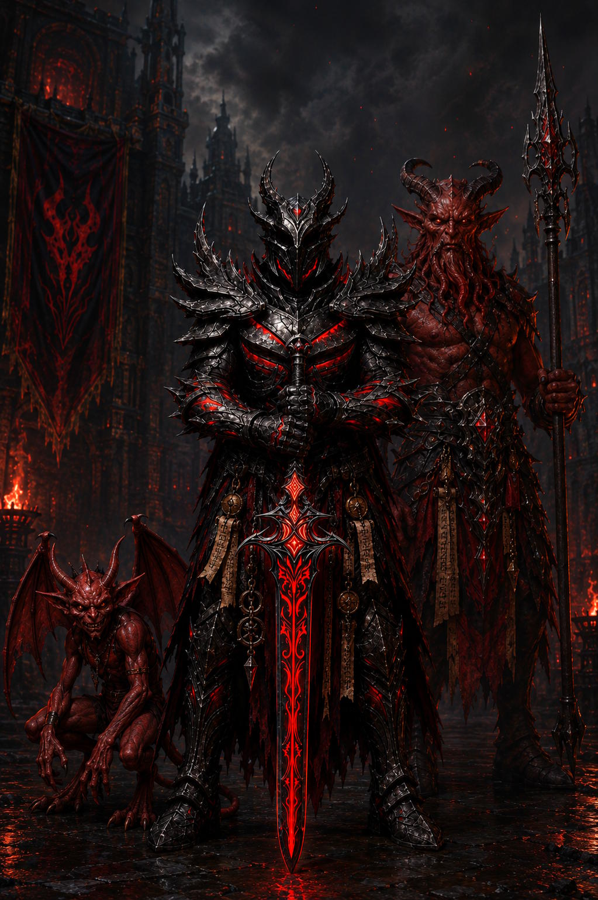

# Subclasses

```{r, layout="l-body-outset", echo=FALSE}
Cleric_Domains <- read_csv("_data/Cleric_Domains.csv", show_col_types = FALSE)
#kable(Cleric_Domains)

Print_Domain <- function(Domain) {
  Domain_Table <- Cleric_Domains %>%
    select(all_of(c("Cleric Level", Domain))) %>%
    rename("Prepared Spells" = all_of(Domain))
  kable(Domain_Table)
}
```

## Cleric: Diabolic Domain

::: center-img
{width="70%"}
:::

While not openly worshiped among civilized society, Asmodeus commands a following easily comparable to any other deity, whom congregate behind closed doors of many a reputable establishment. His teachings urges followers to pursue the accumulation of wealth and power, manipulate and control those whom can help you achieve this, and utterly dominate those who stand in your way.

Clerics of the Diabolic Domain may swear fealty to another Archfiend, but ultimately their power stems from Asmodeus' Divinity along with the Nine Hells themselves. Below is a selection of abilities granted to such clerics.

::: sub-heading
Level 3: Diabolic Domain Spells
:::

Your connection to this divine domain ensures you always have certain spells ready. When you reach a Cleric level specified in the Diabolic Domain Spells table, you thereafter always have the listed spells prepared.

**Diabolic Domain Spells**

```{r, layout="l-body-outset", echo=FALSE}
Print_Domain("Diabolic")
```

::: sub-heading
Level 3: Silver Tongued Devil
:::

You gain proficiency in the Deception and Persuasion skills. You can also use your Wisdom modifier in place of Charisma when making checks with these skills.

Additionally, you gain the service of an Imp Familiar to aid with your infernal dealings. You learn the Find Familiar spell and can cast it without expending material components. When using this spell, the spirit is always a Fiend which takes the form of an Imp.

::: sub-heading
Level 3: Infernal Rejuvenation
:::

As a Magic action, you present your Holy Symbol and expend a use of your Channel Divinity to emit a flash of unholy green energy that can restore a number of Hit Points equal to five times your Cleric level. You may target yourself and any number of creatures within 30ft of you of the Fiend creature type, and divide those Hit Points among them. Creatures healed by this may also end one of following conditions affecting them: Blinded, Deafened, Paralyzed, Poisoned.

::: sub-heading
Level 6: Hellfire Mastery
:::

At 6th level you are granted mastery over the conjuring and manipulation of Hellfire. When you cast a spell which deals Fire damage, this damage ignores a creature's fire resistance. In addition, If you or any allies within 30ft are forced to make a save against a spell or effect dealing fire damage, they automatically succeed.

::: sub-heading
Level 17: As Asmodeus Wills It
:::

At 17th Level you gain full authority over one lesser devil under your command. You can cast a special version of the Infernal Calling spell. When casting this version, the duration is permanent and the creature is placed under the effects of the Planar Binding spell, compelling it to follow your orders to the best of it's ability. You can have one such creature under your control in this way at a time. If you subsequently cast Infernal Calling while another creature is permanently bound you may choose either to instantly banish the other creature to it's home plane, or to temporarily conjure a second creature following the usual rules for for the spell.

***Optional:*** If you do not already possess one, Asmodeus may bestow upon his high ranking clerics a Devil's Talisman, potentially granting the ability to conjure more powerful devils with this spell such as a Horned Devil or Fire Hellion. Whether he chooses to do this will be determined by the Cleric's level of devotion and previous actions (*DM's Discretion*).

## Cleric: Dream Domain

::: sub-heading
Level 3: Dream Domain Spells
:::

Your connection to this divine domain ensures you always have certain spells ready. When you reach a Cleric level specified in the Dream Domain Spells table, you thereafter always have the listed spells prepared.

**Dream Domain Spells**

```{r, layout="l-body-outset", echo=FALSE}
Print_Domain("Dream")
```

## Cleric: Travel Domain

::: sub-heading
Level 3: travel Domain Spells
:::

Your connection to this divine domain ensures you always have certain spells ready. When you reach a Cleric level specified in the Travel Domain Spells table, you thereafter always have the listed spells prepared.

**Travel Domain Spells**

```{r, layout="l-body-outset", echo=FALSE}
Print_Domain("Travel")
```


