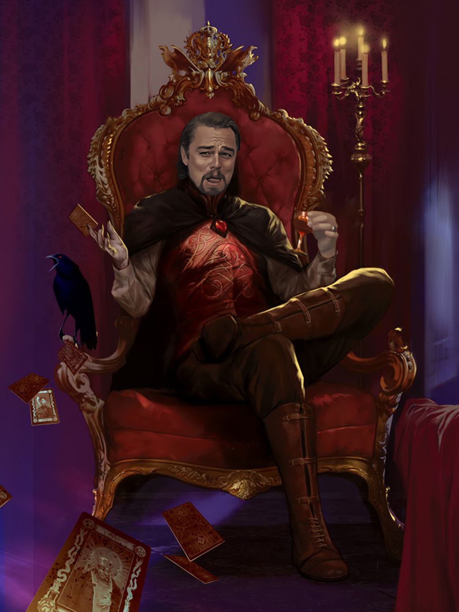

--- 
title: "Campaign setting book [Placeholder]"
author: "Mordenkainen Axios Stormcaller"
date: "`r Sys.Date()`"
site: bookdown::bookdown_site
documentclass: book
bibliography: [book.bib, packages.bib]
# url: your book url like https://bookdown.org/yihui/bookdown
# cover-image: path to the social sharing image like images/cover.jpg
description: |
  This is an attempt at making a campaign setting guide for my D&D campaign in Rmarkdown using a bookdown bs4book template.
link-citations: yes
github-repo: rstudio/bookdown-demo
---

# Welcome Adventurer, have some wine

Strahd is an utter bellend, as you can see below:

::: {.center-img}
{width=70%}
:::
\

## Wait wtf, is this D&D beyond?

No! This is just me fucking around with something called Rmarkdown to make a website for my future D&D setting. It's entirely created by me and published for free on GitHub. 


### But why does it look like D&D beyond?

Cause I'm messing with the formatting to make it a bit more familiar looking, stop asking questions

### What if I want to ask more questions?

Get Fucked

::: {.warning-box}
Warning: the rest of this is just placeholder text from the template I've been using to make sense of this stuff
:::

## Ok so what actually goes here?

This page will be a preamble and then a contents page to guide people to the content they actually want to find.

## Then what?

Then an intro covering what this book is and how to use it

- A High fantasy setting
- Pitching powerful nations in a struggle for power
- Strong varied archetypes unlike any other setting
- A mix of familiar settings from the likes of Arthurian Legend, Norse Mythology, Tolkeinien fantasy, and classic D&D flavour, mixed in with references from videogames and other pop culture, and totally original ideas, all combined together

```{r, echo=FALSE}

library(DT)

```
